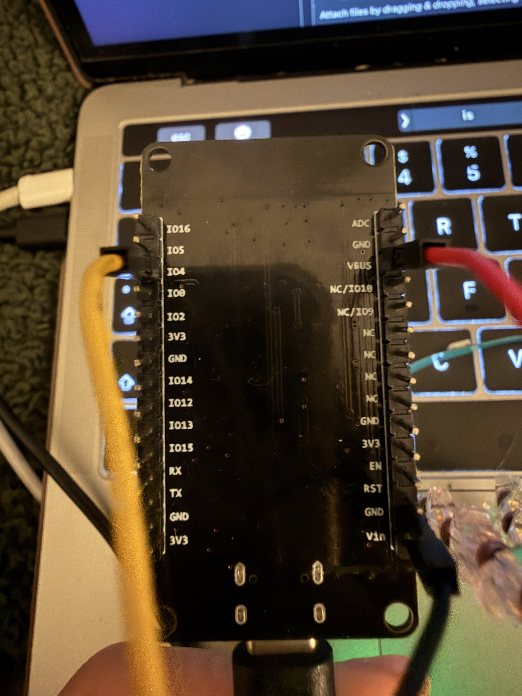
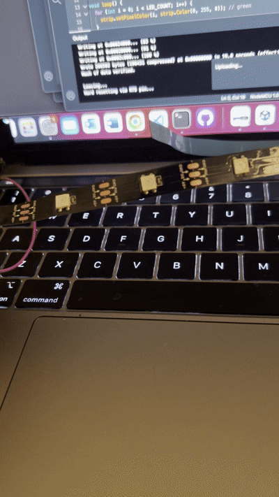
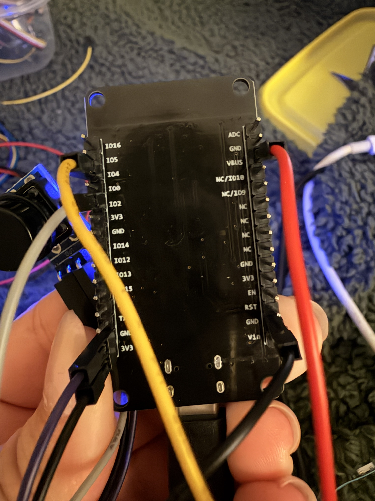
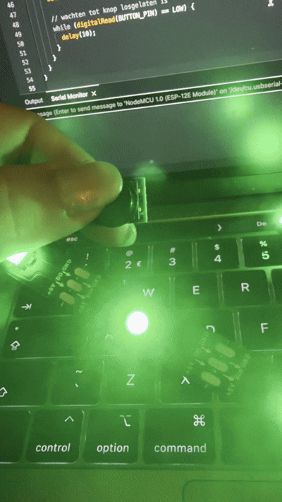
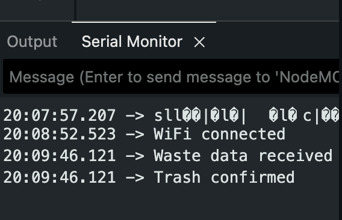

# smart-trash


## Introduction

Smart Trash is an IoT-based reminder system that helps households remember waste collection days.
The system retrieves waste collection data from an online API and translates this information into a physical reminder inside the home.

When a waste collection day is approaching, the device lights up in a specific color that represents the type of waste. 
The reminder stays active until the user presses a physical button to confirm that the waste has been taken outside.

### The manual is divided into 5 steps
1. Connecting the LED strip and button  
2. Setting up the Waste Calendar API  
3. Installing libraries  
4. Writing the code  
5. Uploading and testing the prototype  

## Prerequisites

When following this manual, I assume that you have the following hardware & software installed. If this is not the case, please set-up your Microcontroller correctly before following this manual.

### Hardware
- NodeMCU ESP8266 Microcontroller (or similar board)
- Led strip
- Push button
- Jumpers

### Software
- Arduino IDE
- Wi-Fi credentials
- API access key 


### Required Libraries

Install these libraries using Arduino IDE → Library Manager:
- ArduinoJson
- Adafruit NeoPixel

The following libraries are included by default for ESP8266 boards:
- ESP8266WiFi.h
- ESP8266HTTPClient.h

## Step 1 – Hardware setup

### 3.1: Connect ledstrip
Connect the LED strip as follows:

- 5V of the LED strip (red) - VV (vbus) 
- GND of the LED strip (black) - GND 
- D of the LED strip (yellow) - D2



### 🤓 Testing (LED strip)
Before doing anything with Wi-Fi or the API, I recommend testing if your LED strip works.

Upload this quick test sketch:

```ruby
#include <Adafruit_NeoPixel.h>

#define LED_PIN D2
#define LED_COUNT 8

Adafruit_NeoPixel strip(LED_COUNT, LED_PIN, NEO_GRB + NEO_KHZ800);

void setup() {
  strip.begin();
  strip.show();
}

void loop() {
  for (int i = 0; i < LED_COUNT; i++) {
    strip.setPixelColor(i, strip.Color(0, 255, 0)); // green
  }
  strip.show();
  delay(2000);

  strip.clear();
  strip.show();
  delay(2000);
}
```



#### Common mistakes
- Forgetting to connect GND - LEDs will not work  
- Using the wrong data pin - LED stays off  
- Powering the LED strip incorrectly
- Wrong LED_COUNT - only part of the strip lights up

### 3.2  Button
Connect the button as follows with jumper wires:

- vcc - 3v3
- GND - GND 
- OUT - D7



### Testing (button)
Upload this code:
```ruby
#include <Adafruit_NeoPixel.h>

#define LED_PIN     4    
#define LED_COUNT   30
#define BUTTON_PIN  13    

Adafruit_NeoPixel strip(LED_COUNT, LED_PIN, NEO_GRB + NEO_KHZ800);

bool ledOn = true;           
bool lastButton = HIGH;
unsigned long lastTime = 0;
const unsigned long debounce = 50;

void setStrip(bool on) {
  if (on) {
    for (int i = 0; i < LED_COUNT; i++) {
      strip.setPixelColor(i, strip.Color(0, 255, 0));
    }
  } else {
    strip.clear();
  }
  strip.show();
}

void setup() {
  pinMode(BUTTON_PIN, INPUT_PULLUP);

  strip.begin();
  strip.setBrightness(100);

  setStrip(true);           
}

void loop() {
  bool reading = digitalRead(BUTTON_PIN);

  if (reading != lastButton) {
    lastTime = millis();
    lastButton = reading;
  }

  if ((millis() - lastTime) > debounce) {
    if (reading == LOW && lastButton == LOW) {
      // knop is stabiel ingedrukt
      ledOn = !ledOn;
      setStrip(ledOn);

      // wachten tot knop losgelaten is
      while (digitalRead(BUTTON_PIN) == LOW) {
        delay(10);
      }
    }
  }
}

```
If you push the button the led should go on and off.



#### Common mistakes
- Connecting the button to the wrong pin  
- Button wired to 5V instead of 3V3  

## Step 2:API access

Smart Trash uses the Amsterdam data API to retrieve waste collection data. To access the API, an API key is required.

Register a client at:
https://keys.api.data.amsterdam.nl/clients/v1/register/

Never commit your API key to GitHub!!!

In the code later replace with your API key:

```ruby
const char* API_KEY = "YOUR_API_KEY_HERE";
```

### Common mistakes
- Using an expired or inactive API key
- Forgetting to update the key in the code
- Expecting the API to work immediately

## Step 3: Install libraries

Open Arduino IDE and go to:
Sketch → Include Library → Manage Libraries

Install:
- ArduinoJson
- Adafruit NeoPixel

These libraries are required for:
- Reading JSON data from the API
- Controlling the LED strip

If Arduino gives an error like:
- ArduinoJson.h: No such file or directory
- Adafruit_NeoPixel.h: No such file or directory
it means the library is not installed correctly.

## Step 4: The code
And now the hard the code. This part took a long time, but in the manual I will just post the full code below. You can copy everything, just change these 3 things:
1. const char* WIFI_SSID = "YOUR_WIFI_NAME"; // replace with your network name
2. const char* WIFI_PASSWORD = "YOUR_WIFI_PASSWORD"; // replace with your network password
3. const char* API_KEY = "YOUR_API_KEY_HERE"; // replace with your api key

Create a new Arduino sketch and paste everything below.

```ruby
#include <ESP8266WiFi.h>
#include <WiFiClientSecure.h>
#include <ArduinoJson.h>
#include <Adafruit_NeoPixel.h>

const char* WIFI_SSID = "YOUR_WIFI_NAME"; // replace with your network name
const char* WIFI_PASSWORD = "YOUR_WIFI_PASSWORD"; // replace with your network password
const char* API_KEY = "YOUR_API_KEY_HERE"; // replace with your api key

#define LED_PIN     D5
#define BUTTON_PIN  D2

#define LED_COUNT 8
#define LED_BRIGHTNESS 80
#define UPDATE_INTERVAL 60000

#define API_HOST "api.data.amsterdam.nl" // host van de API

WiFiClientSecure client;
Adafruit_NeoPixel strip(LED_COUNT, LED_PIN, NEO_GRB + NEO_KHZ800);

bool reminderActive = false;
unsigned long lastCheck = 0;

void setup() {
  Serial.begin(115200);

  pinMode(BUTTON_PIN, INPUT_PULLUP);

  strip.begin();
  strip.setBrightness(LED_BRIGHTNESS);
  strip.show();

  WiFi.begin(WIFI_SSID, WIFI_PASSWORD);
  Serial.print("Connecting to WiFi");

  while (WiFi.status() != WL_CONNECTED) {
    delay(500);
    Serial.print(".");
  }

  Serial.println("\nWiFi connected");

  client.setInsecure(); // prototype only
}

void showGreenReminder() {
  for (int i = 0; i < LED_COUNT; i++) {
    strip.setPixelColor(i, strip.Color(0, 255, 0));
  }
  strip.show();
  reminderActive = true;
}

void clearLEDs() {
  strip.clear();
  strip.show();
}

void getWasteData() {
  // Prototype behavior: API call simulated
  Serial.println("Waste data received");
  showGreenReminder();
}

void loop() {
  if (!reminderActive && millis() - lastCheck > UPDATE_INTERVAL) {
    lastCheck = millis();
    getWasteData();
  }

  if (reminderActive && digitalRead(BUTTON_PIN) == LOW) {
    clearLEDs();
    reminderActive = false;
    Serial.println("Trash confirmed");
    delay(500);
  }
}


```

## Step 5  – Upload & test

Connect the NodeMCU to your laptop via USB

In Arduino IDE select:
Tools - Board - NodeMCU 1.0 (ESP-12E Module)
Tools - Port - (select the correct port)

Push: CMD+U or the arrow 

Open Serial Monitor 

### Expected behavior

After connecting to Wi-Fi the Serial Monitor prints:

WiFi connected
Waste data received 
The LED strip turns green
Pressing the button turns the LED strip off



If this works: the prototype works!


